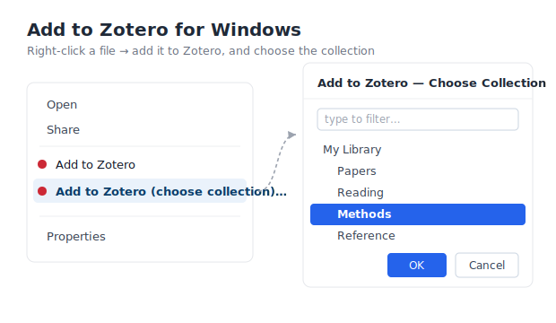

# Add to Zotero for Windows

> Right-click any file in Windows Explorer → **Add to Zotero**. Adds the file to your running
> Zotero as an item and auto-retrieves PDF/EPUB metadata — the same result as dragging it into
> Zotero, without leaving the file manager. Optionally pick the target collection.


**English** · [中文说明](README.zh-CN.md)

<p align="center"></p>

<sub>Right-click menu (left) and the searchable collection picker (right).</sub>

## Features

- **Right-click → Add to Zotero** for local files (PDF, EPUB, DjVu, MOBI, AZW3, CAJ, …).
- Two menu items:
  - **Add to Zotero** — adds to Zotero's currently-selected collection (fast, no dialog).
  - **Add to Zotero (choose collection)…** — a searchable picker to choose any collection.
- **Auto metadata** — PDF/EPUB get title/author/DOI retrieved automatically (like drag-and-drop).
- **Multi-select** — select many files; the picker appears once and files them all together.
- **Bilingual** — English / 中文, auto-detected; override at install time.
- **No plugin, no browser, no admin** — writes only to the current user's registry (`HKCU`).
- **No Zotero configuration required** — see [How it works](#how-it-works).

## Requirements

| | |
|---|---|
| OS | Windows 10 / 11 |
| Zotero | **7 or newer** (verified on 9.0.5 / 9.0.6). Must be running (the tool can auto-start it). |
| PowerShell | Windows PowerShell 5.1 (built into Windows) |

## Install

1. Download and extract the release anywhere — even a temporary folder (see step 3).
2. Double-click **`Install.bat`** (writes to `HKCU` only; no admin prompt). It copies the runtime
   to `%LOCALAPPDATA%\AddToZotero` and points the menu there.
3. **You can now delete the downloaded folder** — the tool runs from that copy. Right-click a PDF to try it.

> Prefer to run from the current folder instead? Use `powershell -ExecutionPolicy Bypass -File Install.ps1 -InPlace` (then don't move or delete that folder).

> **SmartScreen / antivirus**: everything is plain-text script (`.ps1` / `.vbs` / `.bat`) you can inspect. Choose *More info → Run anyway* if prompted.

## Usage

Keep **Zotero open** — or not: if it's closed, the tool launches Zotero (with a "starting…" notification) and waits up to 60 s.
Right-click a file — on **Windows 11 click "Show more options"** (or `Shift`+`F10`) first:

- **Add to Zotero** → goes to Zotero's currently-selected collection.
- **Add to Zotero (choose collection)…** → a dialog lists all writable collections (indented,
  current one pre-selected). Type to filter, then double-click or press `Enter`; `Esc` cancels.

## Language

Auto-detected from your Windows locale. To force a language:

```powershell
powershell -ExecutionPolicy Bypass -File Install.ps1 -Language en   # or: zh
```

## Customize

```powershell
# Add more file types
powershell -ExecutionPolicy Bypass -File Install.ps1 -Extensions '.pdf','.docx','.txt'
# Add the menu for ALL files
powershell -ExecutionPolicy Bypass -File Install.ps1 -AllFiles
# Quick item only (skip the "choose collection" item)
powershell -ExecutionPolicy Bypass -File Install.ps1 -NoPicker
```

Default extensions: `.pdf .epub .djvu .mobi .azw3 .caj`. Only PDF/EPUB get metadata retrieval; other types are stored as standalone attachments (title = file name).

## Uninstall

Double-click **`Uninstall.bat`** (in `%LOCALAPPDATA%\AddToZotero`, or in the download folder if you kept it).
It removes the menu items and cleans up the installed copy.

## How it works

A running Zotero exposes a **connector HTTP server** on `127.0.0.1:23119` (used by the browser
Zotero Connector). This tool talks to it directly:

1. `POST /connector/getSelectedCollection` — list collections (for the picker).
2. `POST /connector/saveStandaloneAttachment` — upload the file bytes (returns `201`); Zotero
   stores it and auto-recognizes PDF/EPUB metadata.
3. `POST /connector/updateSession` — if you chose a collection, move the item there (returns `200`).

**No Zotero setting needs to be enabled.** The connector server is always on while Zotero runs.
(The separate *"Allow other applications… "* setting only controls the read-only `localhost:23119/api/`
REST API, which this tool does **not** use.)

`launch.vbs` is a tiny hidden launcher so the right-click action shows no console flash.

## Troubleshooting

- **No menu?** On Windows 11 it lives under *Show more options*. Or run `Install.bat` first.
- **`Diagnose.bat`** reports Zotero status, version, `supportsAttachmentUpload`, and which
  extensions are registered.
- **Log**: `add-to-zotero.log` next to the scripts. Key lines: `TARGET C37 Papers`, `OK paper.pdf`, `DONE ok=1 fail=0`.
- **Execution policy locked (managed PC):** `Set-ExecutionPolicy -Scope CurrentUser RemoteSigned`.

## Compatibility

Relies on the Zotero connector's `saveStandaloneAttachment` / `updateSession` endpoints and the
`supportsAttachmentUpload` capability. Present in Zotero 7+; verified on 9.0.5 / 9.0.6. Run `Diagnose.bat`
to confirm on your machine.

## Credits

This repository was created and is maintained by **Claude**, Anthropic's [Claude Code](https://claude.com/claude-code) agent, working with **[mak0711](https://github.com/mak0711)**.

## License

[MIT](LICENSE) © 2026 mak0711
